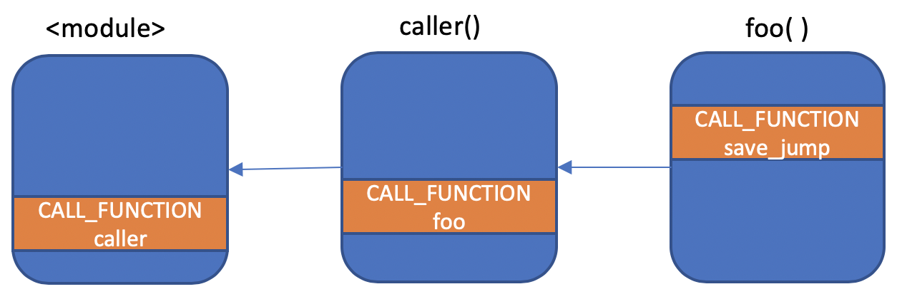
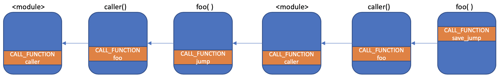

# Checkpointing Python Programs

**TL;DR:** Here's an implementation of setjmp() and longjmp() for Python 3.6+. The
state of the program can be serialized to disk or over the network. There are a few
other twists and Python flavors.

If you write data processing pipelines that take hours to run on your desktop,
you live in fear of crashes. Maybe you've invested in some hand-woven
checkpointing code.

This package helps you checkpoint your pipeline's work automatically.  When
your pipeline crashes, this package helps you restart it from the last
checkpoint.  As a bonus, if you modify your code to fix the crash, this package
resumes it from a known good checkpoint that does not get affected by your code
change.

Your code ends up looking like this:
```python
import function_checkpointing as ckpt

def sub_stage1():
    for step in range(5):
        ... do some work...

        # Snapshot the state of this function to disk
        ckpt.save_checkpoint(f"snapshot sub_stage1 {step}")  

def processing():
    sub_stage1()   # Do some heavy lifting

    ... do some more work...

    # Snapshot the state of this function to disk
    ckpt.save_checkpoint("snapshot 2")  

    ... do some more work...
```

You can drop a checkpoint anywhere in your code.  You can then call
`resume_from_checkpoint` to resume your code with the state it had at the
corresponding `save_checkpoint` call:

```python
ckpt.resume_from_checkpoint("snapshot 2")
```

The function `save_checkpoint` snapshots to disk the state of your program as
of when it's called to disk. When `resume_from_checkpoint` restores your
program from this checkpoint, `save_checkpoint` appears to just be returning with
an empty return value.


A disclaimer before we get too far: It's nearly impossible to automatically
fully checkpoint a program.  That would require checkpointing the state of the
resources your program depends on too, like the disk files and database servers
it accesses, and the state of the GPU. That becomes very hard unless all these
external resources provide a standardized snapshotting mechanism. You may need
to store some of the state manually. This particular package also has some
intentional design [limitations](#Limitations).


# How it Works: Python versions of longjmp and setjmp under the hood

The main entry points of this package are `save_checkpoint` and
`resume_from_checkpoint`.  Under the hood, these functions write and read from
pickle files, and call functions named `save_jump` and `jump` respectively.  These
two functions are useful in their own right. If you grok them, you grok this package.


## `save_jump`

`save_jump` takes no argument. It bundles up and returns the chain
of frames that led up to this call. This bundle contains the local variables,
the Python bytecode interpreter stack, and the bytecode instruction pointer at
the location where `save_jump` was called. It also includes this information
for the parent frame that called `save_jump`, and its caller's frame, all the
way up to the topmost frame.  It then returns this stashed bundle of stack
frame as a Python object (which you can inspect and modify if you wish).

But there's a twist: `save_jump` can return twice. The above is what happens
when you're taking a snapshot.  But `save_jump` can also return when you're
restoring a snapshot. In that case, the return value of `save_jump` is an empty
list. You can use this to check if your program is being restored or if it's
checkpointing:

```python
c = ckpt.save_jump()
if not c:
    # We're resuming from a checkpoint. Reopen connection to the database, or whatever.
    db = connect_to_database()
```

The semanetics of `save_jump` are similar to those of the POSIX setjmp() function.

## `jump`

`jump` takes one argument: a bundle returned by `save_jump`. It restores the
state of the frame stack to the state that `save_jump` captured.

But instead of rooting the stack frames at the topmost frame, it roots it
under its own stack frame. That means when the topmost stackframe that
originated the sequence of calls that culminated in `save_jump` finishes,
control returns to the stack frame that called `jump`.

This is an important difference with the POSIX `longjmp()` function, which
never returns.

Practically, this means the function foo below returns twice, an unusual concept
in most programming languages:

```python
import function_checkpointing.save_restore as save_restore

def foo():
   c = save_restore.save_jump()
   if c:
      print('saved checkpoint')
      save_restore.jump(c)
   else:
      print('restored from checkpoint')

   print('foo returns')
```

This function prints:
```
saved checkpoint
restored from checkpoint
foo returns
foo returns
````

To appreciate this, let's call this function from another function:
```python
def caller():
    print('caller->foo')
    foo()
    print('foo->caller')
```
This function returns twice as well. Calling it produces
```
caller->foo
saved checkpoint
restored from checkpoint
foo returns
foo->caller
foo returns
foo->caller
```

Here's an illustration of what's happening. Calling caller results in a call to
foo, which results in a call to `save_jump`. This diagram captures the snapshot
captured in the bundle `c`:



As execution proceed down foo, we reach a call to `jump`. Jump reroots the
callchain captured in `c` under itself and fast forwards the Python interprter
to the leaf frame:



There are now two instances of foo in the call stack.  The rightmost frame,
foo, continues executing until it returns. Then `caller` finishes executing,
then the top level module executes, and finaly, the `jump` function returns. We
have reached the end of the leftmost foo, so foo returns. Notice that foo
returned twice.

If you're not enjoying this mindbending fact, you can just terminate your program
after jump returns by calling `sys.exit` immediately after `jump`.


## Is this like `yield` and Python generators?

There is a superficial resemblence between `save_jump` and the Python `yield`
statement: both stash the current stack frame. But then `yield` forces the
interpreter to exit the stack frame and returns control to the caller's stack
frame, essentially acting as `return`. On the other hand, `save_jump`  saves
the entire chain of stack frames, and allows execution to remain in the current
frame. `save_jump` appears as a normal function call and not at all like
`return`.

Similarly, there is a superficial resemblence between `jump` and calling a
generator's `send` method. Calling `send` resumes the generator frame's
execution at its last `yield`.  But `jump` does more than that: it resumes
execution of the entire call chain leading up to `save_jump`, not just the
single stack frame where `save_jump` was called.

My [earlier attempt at an automatic
checkpointing](http://github.com/a-rahimi/python-checkpointing) library used
generators.  The practical limitation with generators is that you could only
snapshot one function (the generator), not the call chain that resulted in the
generator being called. In my previous attempt, if you wanted to snapshot
multiple layers of the call chain, you'd have to use `yield from` at each
layer, which imposed an inconvenient structure on your code.


# Bonus: Selecting a checkpoint by detecting changes in your code

Normally, you'd want to resume your program from the latest checkpoint it
created before it crashed. But after a crash you might modify your code to fix
the problem that caused the crash. In such cases,  instead of resuming from the
latest checkpoint, this package helps you identify the latest checkpoint that
incurred no code change, and to resume from that checkpoint.

To detect where your code has changed, the package provides a run-time profiler
that logs the function calls in your code. The call log is stored to disk along
with each checkpoint.  When it's time to restore the state of the program, we
identify the latest checkpoint whose call log involves no calls to any modified
function.

A few functions give you control over this automatic restart mechanism.
* `start_call_tracing` turns on the call tracer.
* `save_checkpoint_and_call_log` is a variant of `save_checkpoint` that stores
  the call log along with the checkpoint.
* `resume_from_last_unchanged_checkpoint` is a variant of
  `resume_from_checkpoint` that identifies and loads the relevant checkpoint.

See [examples/detect_code_change.py](examples/detect_code_change.py) for an
example.


# Technical Details

Saving the Python interpreter state is tricky. The CPython interpreter has
effectively two stacks: the interpeter stack, which the bytecode instructions
operate on, and the C stack, which the bytecode interpreter uses to keep track
of its own state. This package manipulates the state of both stacks.

In my previous attempt, I documented [why this problem is
hard](https://github.com/a-rahimi/python-checkpointing#failed-attempts).  The
chief concern is that obtaining the top of the CPython stack seems impossible
([corroborated by this excellent answer on
Stackoverflow](https://stackoverflow.com/a/44443331/711585)). This package does
this by relying on some known facts about the depth of the python stack: When a
function is called, its arguments are on the stack. We can inspect the number
of arguments of the function from the particular flavor of CALL bytecode being
used, and increment our estimate of the stack depth accordingly.  Yet more
object can be on the stack: if an exception is being handled or the caller is
in the middle of a loop, the stack contains respectively the exception triplet
and the loop iterator. We count the level of nesting of exceptions and loops to
count these objects too.

To manipulate the C stack, this package guides the CPython bytcode
interpreterer, `_PyEval_EvalFrameDefault`, to call itself recursively. These
nested calls cause the C stack to attain the state it had when `save_jump` was
called.


# Limitations

This is a hobby project, not a software engineering artifact. Its limitations
are commensurate:

* Requires Python 3.6+: It relies on
  [PEP523](https://www.python.org/dev/peps/pep-0523/), which is only available
  in 3.6 and later.

* Only tested with Python 3.6 and 3.7. There's no fundamental limitation here
  as far as I know.  These just happen to be the Pythons I have.

* Does not snapshot global variables: Again, no fundamental limitation here as
  far as I know.  Saving globals is simultaneously relatively straightforward
  and not particular urgent for me, so it's not yet implemented (it might make
  sense to implement it as an auxiliary package to keep this one simple).

* Might crash. Your code could segfault. I'll fix the package if you send me a
  bug report. Instead of developing the perfect checkpointer with exhaustive
  test cases, I built the simplest checkpointer for myself, and I refine it as my
  usage outgrows it.

# Acknowledgement

I learned how to use Cython to do this manipulation from this
[very helpful repo](https://github.com/Elizaveta239/frame-eval). I also copied
code from it.

This [Stackoverflow answer](https://stackoverflow.com/a/44443331/711585) does a good
job of explaining why this problem was hard to solve.
